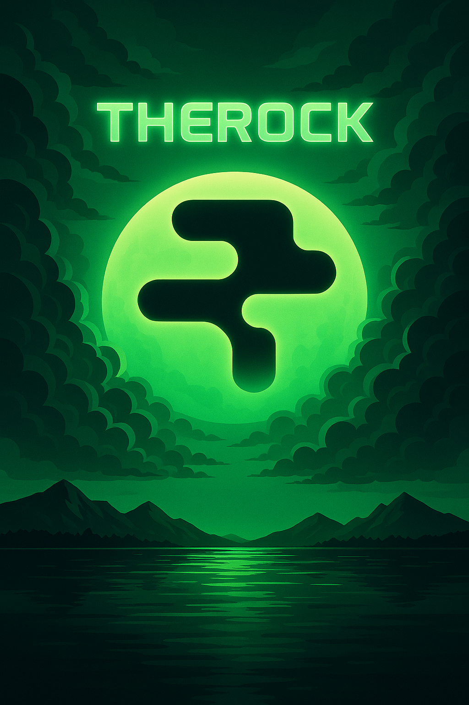

# 🎮 Tap-Tap Rialo

> Game kasual sederhana berbasis **HTML5 Canvas**  
> Klik koin untuk skor, hindari bom, dan dengarkan musik latar seru! 🚀  



---

## 🕹 Gameplay

- 💰 **Koin** akan jatuh dari atas layar — **klik/tap** sebelum jatuh ke bawah untuk menambah skor.
- 💣 **Bom** ikut jatuh sebagai rintangan — jangan diklik, kalau tidak nyawa berkurang!
- ❤️ Pemain punya **3 nyawa**. Kalau habis → **Game Over**.
- 🎵 Musik otomatis dari **bgm.mp3** akan diputar saat game dimulai.
- 🏆 Skor akhir akan dikategorikan:
  - **1 – 30** : Bad People 🙃  
  - **31 – 60** : Good People 🙂  
  - **61+** : Amazing People 🤩  

---

## ✨ Fitur

- Animasi sprite **flip-coin** dan **flip-bomb** untuk efek visual yang keren.
- Background kustom (`bg-game.png`).
- Layar pembuka dengan cover art (`cover-bg.png`) dan tombol **START**.
- Layar Game Over dengan tombol **TRY AGAIN** & **EXIT**.
- Musik latar (`bgm.mp3`) yang aktif setelah klik tombol START.
- Bisa dimainkan di **PC** maupun **mobile** (responsif).

---

## 📂 Struktur File

├── index.html # File utama game
├── bg-game.png # Background permainan
├── cover-bg.png # Cover halaman awal
├── coin.png # Ikon koin (fallback)
├── bomb.png # Ikon bom (fallback)
├── flip-coin.png # Sprite animasi koin
├── flip-bomb.png # Sprite animasi bom
├── btn-start.png # Tombol START
├── btn-tryagain.png # Tombol TRY AGAIN
├── btn-exit.png # Tombol EXIT
├── bgm.mp3 # Musik latar
└── README.md # Dokumentasi

---

## 🚀 Cara Main di Lokal

1. Clone repo ini:
   ```bash
   git clone https://github.com/username/tap-tap-rialo.git
   cd tap-tap-rialo
Buka index.html di browser favoritmu.
(Atau gunakan ekstensi Live Server di VSCode agar lebih lancar.)

🌐 Deploy

Kamu bisa dengan mudah deploy game ini ke:

GitHub Pages
Aktifkan Pages di repo ini → pilih branch main + root folder.

Vercel / Netlify
Upload repo → game langsung online.

🛠 Teknologi

HTML5 + Canvas API untuk rendering.

JavaScript Vanilla untuk logic gameplay.

CSS3 untuk scaling dan responsive layout.

👨‍🎨 Credit

🎨 Desain aset & branding: Rialo Community

👾 Coding: Bulubulu1230

🚀 Judul game: Tap-Tap Rialo

📸 Preview

“Tap fast, dodge smart, and be an Amazing People in Tap-Tap Rialo!” 💥

---


